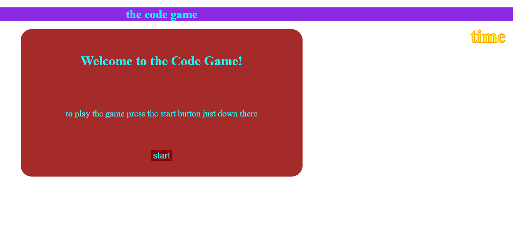
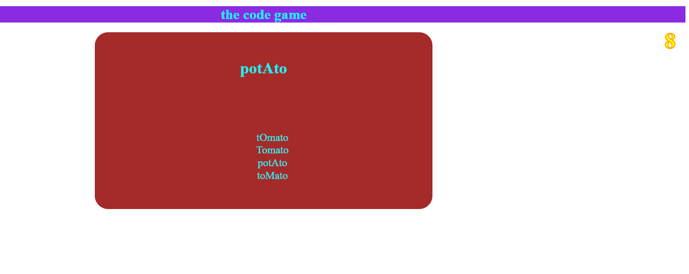

# knockoff-buzzfeed-quiz

## Description
 this was orignally going to be a knock off coding/ buzzfeed quiz but i thought it would be funnier and easier if i just made a find the potato clicker

 all of the potato questions are related to their correspoding potato answer and the caps are really crazy to make everything harder to do quickly

 the quiz stores all of the highscores locally and displays the top 3 highest though it keeps the top 5 in storage  

 i also had a challange to make as much of this as i can in javascript and css

## Usage
    to play just press the play button read the instructions and press play again press all of the potatoes you can find good luck its pretty hard to do quickly
    there is a timer in the top right of the screen

    md
    )
    
    md
    
    
